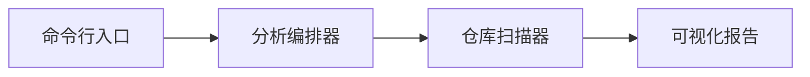
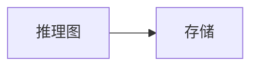
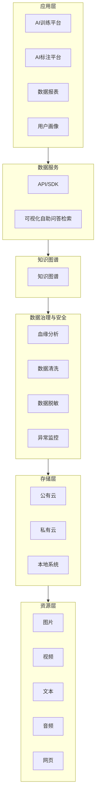
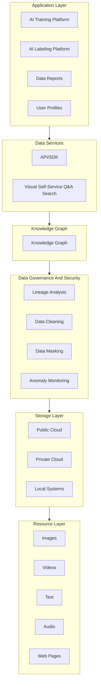

# Diagram Rules

Use diagrams to compress understanding, not to decorate a report. A good diagram is tight, scoped, and traceable.

## Mermaid And Chinese Labels

Use ASCII node ids and quoted Chinese labels:



Rules:

- Keep ids ASCII: `api`, `worker`, `storage`.
- Put Chinese display text in quoted labels: `api["接口层"]`.
- Quote labels containing Chinese, spaces, punctuation, slashes, colons, or parentheses.
- Do not use Chinese as node ids.
- Do not use Mermaid keywords, diagram declarations, or ambiguous built-ins as node ids.
- Prefer semantic prefixed ids: `layer_app`, `svc_api`, `data_store`, `flow_ingest`, `ext_github`.

## Mermaid Node ID Safety

Never use these exact words as node ids, subgraph ids, class ids, or edge ids:

```text
graph
flowchart
subgraph
end
class
classDef
click
style
linkStyle
default
interpolate
direction
TB
TD
BT
LR
RL
node
edge
```

Avoid ids that start with `o` or `x` when immediately following an edge operator, because Mermaid flowchart syntax treats `---o` and `---x` as special edge endings. Prefer `node_ops` instead of `ops`, `svc_xray` instead of `xray`.

Unsafe:

```mermaid
flowchart LR
  graph["推理图"] --> store["存储"]
```

Safe:



If a repository component is literally named `graph`, `default`, `class`, `end`, or another Mermaid keyword, keep that word only in the quoted label and use a safe prefixed id.

## Pick The Right Diagram

- `flowchart`: Default for architecture sketches, dependencies, workflows, and data movement.
- `architecture-beta`: Use when component topology, service grouping, and left/right/top/bottom connections are clearer than a flowchart. It is acceptable despite Mermaid syntax evolution.
- `block-beta`: Use when compact layout control matters more than arrows.
- `sequenceDiagram`: Use for a specific runtime path with ordered interactions.
- `quadrantChart` or Markdown table: Use for opportunity value/cost/risk maps.
- `rva-layer-map`: Use for broad layered capability architecture maps that should look like horizontal bands or rows, such as application layer, service layer, governance layer, storage layer, and resource layer. This is rendered by the HTML report, not Mermaid.

Do not force every concept into one diagram type.

## Layered Architecture Diagram

A layered architecture diagram is required when the repository has recognizable layers, platforms, storage tiers, application modules, or resource types. This is often the highest-value Quick Scan diagram.

Use it to answer: "What are the major layers and where do capabilities live?"

Prefer `rva-layer-map` for this shape. Mermaid `flowchart` or `subgraph` can describe the structure, but Mermaid auto-layout often turns this into a tall vertical chain instead of a compact architecture canvas.

All labels in this diagram must follow the report language. Only machine ids stay language-neutral ASCII when a Mermaid fallback is used.

Chinese `rva-layer-map` template:

```rva-layer-map
{
  "title": "分层架构图",
  "status": "candidate",
  "layers": [
    {"id": "layer_app", "label": "应用层", "items": ["AI训练平台", "AI标注平台", "数据报表", "用户画像"]},
    {"id": "layer_service", "label": "数据服务", "items": ["API/SDK", "可视化自助问答检索"]},
    {"id": "layer_knowledge", "label": "知识图谱", "items": ["知识图谱"]},
    {"id": "layer_governance", "label": "数据治理与安全", "items": ["数据编目", "规则定义", "目录管理", "血缘分析", "影响分析", "数据清洗", "数据脱敏", "安全传输", "异常监控"]},
    {"id": "layer_storage", "label": "存储层", "items": ["公有云", "私有云", "混合云", "本地系统"]},
    {"id": "layer_resource", "label": "资源层", "items": ["图片", "视频", "文本", "音频", "网页"]}
  ]
}
```

English `rva-layer-map` template:

```rva-layer-map
{
  "title": "Layered Architecture Map",
  "status": "candidate",
  "layers": [
    {"id": "layer_app", "label": "Application Layer", "items": ["AI Training Platform", "AI Labeling Platform", "Data Reports", "User Profiles"]},
    {"id": "layer_service", "label": "Data Services", "items": ["API/SDK", "Visual Self-Service Q&A Search"]},
    {"id": "layer_knowledge", "label": "Knowledge Graph", "items": ["Knowledge Graph"]},
    {"id": "layer_governance", "label": "Data Governance And Security", "items": ["Data Catalog", "Rule Definition", "Directory Management", "Lineage Analysis", "Impact Analysis", "Data Cleaning", "Data Masking", "Secure Transport", "Anomaly Monitoring"]},
    {"id": "layer_storage", "label": "Storage Layer", "items": ["Public Cloud", "Private Cloud", "Hybrid Cloud", "Local Systems"]},
    {"id": "layer_resource", "label": "Resource Layer", "items": ["Images", "Videos", "Text", "Audio", "Web Pages"]}
  ]
}
```

Mermaid fallback, only when HTML rendering is not available:



English Mermaid fallback:



Rules:

- Use `layer_*` ids for layer subgraphs.
- Use `app_*`, `svc_*`, `data_*`, `gov_*`, `sec_*`, `store_*`, `res_*`, or `ext_*` for nodes.
- Keep each layer to 2-6 capability nodes. If there are more, merge them into grouped capabilities.
- Use layer edges only when exact module-to-module edges would clutter the view.
- Mark the diagram as candidate in Quick Scan unless verified by Focused Maps.

For broad capability architecture, do not force Mermaid if the user needs a compact human-facing architecture map. Use `rva-layer-map` and let the HTML renderer control layout.

## Compactness Gate

Every diagram must pass:

- One diagram answers one question.
- Prefer 5-9 nodes. Hard limit 12 nodes unless explicitly justified.
- Prefer 6-12 edges. Hard limit 16 edges unless explicitly justified.
- Use one primary direction: `LR` for architecture/data flow, `TB` for step workflows.
- Group files into conceptual modules. Do not draw every file, class, or function.
- Avoid crossing more than two group boundaries in one diagram.
- If arrows cross heavily or the diagram needs many labels, split it.
- Edge labels should be short verbs: 调用, 读取, 写入, 校验, 发布, 转换.
- Do not add vague nodes like "核心逻辑" unless backed by evidence and clarified by files.

## Diagram Levels

Keep each diagram at one abstraction level:

- **L0 Context**: Repository and external actors/systems.
- **L1 Architecture**: Components or subsystems.
- **L2 Runtime**: One critical call/request/job path.
- **L3 Data**: Important data objects and state changes.
- **L4 Evidence**: Hotspots, risks, and opportunities.

Do not mix file tree, runtime sequence, data ownership, and opportunities in one diagram.

## Visual Model First

For Focused Map and Full Visual Report diagrams, create a small model before Mermaid:

```yaml
diagram:
  id: architecture
  title: "仓库架构图"
  status: candidate
nodes:
  - id: api
    label: "接口层"
    kind: component
    status: observed
    evidence:
      - file: src/api/routes.py
  - id: service
    label: "服务层"
    kind: component
    status: observed
    evidence:
      - file: src/services/user_service.py
edges:
  - from: api
    to: service
    label: "调用"
    status: derived
    evidence:
      - file: src/api/routes.py
```

Then render Mermaid from the model. If an edge has no evidence, either remove it or mark the diagram/edge as candidate.

Quick Scan can use a lighter model inline, but still must preserve uncertainty.

## Required Diagram Set By Mode

Quick Scan:

- Layered Architecture Sketch when recognizable layers exist; otherwise Repo Architecture Sketch.
- Primary Flow Sketch when a likely flow is discoverable.

Focused Map:

- One local architecture, runtime, or data-flow diagram chosen by the focus.

Full Visual Report:

- System Context Map.
- Architecture Map.
- Critical Runtime Flow.
- Data Flow Map when data matters.
- Hotspot Map or hotspot table.
- Opportunity Matrix.

## Architecture-Beta Example

Use `architecture-beta` when component groups and directional service edges are more readable:


If `architecture-beta` rendering fails in the target environment, convert the same visual model to `flowchart`.
