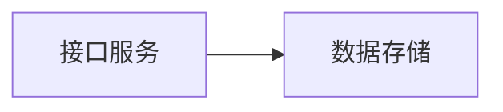
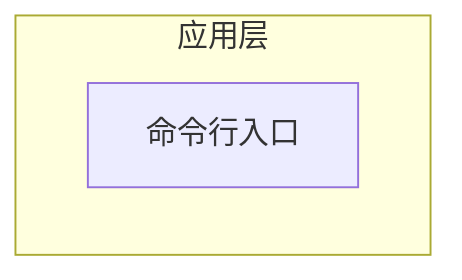
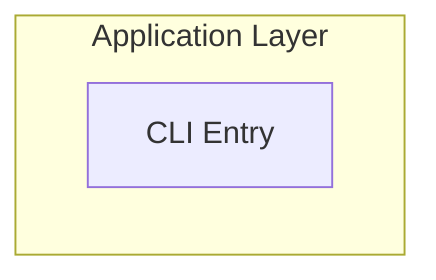

# Language Policy

Use the user's current interaction language as the default report language.

## Default

- If the user is interacting in Chinese, write report headings, diagram labels, table headers, confidence notes, HTML title, navigation labels, and render status in Chinese.
- If the user is interacting in English, use English.
- If the interaction is mixed, prefer the language of the latest explicit request.
- If the user explicitly asks for a language, follow that request.

Do not default to English just because code identifiers, file names, or package metadata are English.

## Code And Evidence

Keep source identifiers, file paths, package names, commands, and API names unchanged.

Examples:

```md
## 分层架构草图

Evidence:
- `src/api/routes.py`
- `package.json`
```

Use localized prose around unchanged technical identifiers.

## Diagram Labels

Use localized labels inside all quoted Mermaid labels, including node labels, edge labels, and `subgraph` labels.



For Chinese users:



For English users:



Node ids remain ASCII and safe regardless of report language.

## HTML Render

When generating HTML, pass `--language zh` for Chinese reports or `--language en` for English reports. If omitted, the renderer uses `auto` and infers from document content, but the analysis workflow should set the language deliberately when the user's interaction language is known.

Examples:

```bash
/path/to/repo-visual-analysis/scripts/render_report_html.py --analysis-dir .repo-visual-analysis --language zh
/path/to/repo-visual-analysis/scripts/render_report_html.py --analysis-dir .repo-visual-analysis --language en
```
