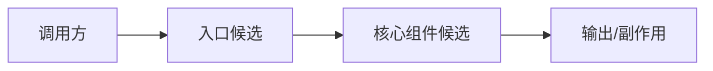
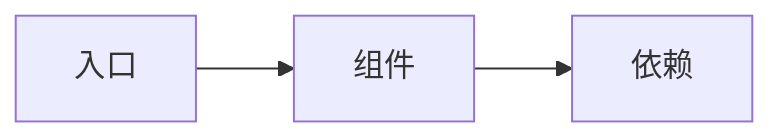

# Report Templates

Adapt these templates to the request. Keep reports concise and evidence-first.

Use the user's current interaction language. The English headings below are structural placeholders; localize them when the user is interacting in another language.

Mermaid labels must also be localized. For example, use `subgraph layer_app["应用层"]` for Chinese reports and `subgraph layer_app["Application Layer"]` for English reports; keep the id `layer_app` unchanged.

For broad layered capability maps, prefer `rva-layer-map` over Mermaid so the HTML report can render a compact architecture canvas instead of a tall auto-layout graph.

## Quick Scan

````md
# Repository Quick Scan

## Snapshot
- Project type:
- Main languages:
- Manifests/build tools:
- Test/CI signals:
- Docs:

## Repo Architecture Sketch

Prefer a layered architecture sketch when layers are visible:

```rva-layer-map
{
  "title": "分层架构图",
  "status": "candidate",
  "layers": [
    {"id": "layer_entry", "label": "入口与展示层", "items": ["Web/API 入口", "管理后台", "CLI/离线工具"]},
    {"id": "layer_orchestration", "label": "应用编排层", "items": ["工作流编排", "任务调度", "权限/会话"]},
    {"id": "layer_capability", "label": "能力层", "items": ["领域逻辑", "检索/RAG", "分析管道"]},
    {"id": "layer_data", "label": "数据与存储层", "items": ["数据库", "文件/对象存储", "缓存"]},
    {"id": "layer_external", "label": "外部依赖层", "items": ["第三方 API", "模型服务", "消息队列"]}
  ]
}
```

Fallback compact sketch:



Confidence: candidate. This sketch is based on top-level structure and manifest/search evidence.

## Primary Flow Sketch

Only include this when a likely flow is visible.

## Component Candidates

| Component | Evidence | Confidence | Why focus |
| --- | --- | --- | --- |
| 接口层 | `src/api`, route files | medium | likely request boundary |

## Focus Queue

1. Component/path:
   Reason:
   Next verification:

## Open Questions
- ...
````

## Focused Map

````md
# Focused Map: <component or flow>

## Scope
- Focus:
- Why this matters:
- Files inspected:
- Searches/commands:

## Local Map



## Verified Responsibilities

| Responsibility | Evidence | Confidence |
| --- | --- | --- |

## Boundaries
- Owns:
- Depends on:
- Exposes:
- Does not cover:

## Risks And Hotspots

| Risk | Evidence | Impact | Next verification |
| --- | --- | --- | --- |

## Evidence-Backed Opportunities

| Opportunity | Evidence | Benefit | Cost/Risk | Next step |
| --- | --- | --- | --- | --- |

## Open Questions
- ...
````

## Full Visual Report

````md
# Repository Visual Report

## Executive Summary
- What this repository appears to do:
- Most important components:
- Highest-value risks/opportunities:
- Confidence:

## System Context Map

## Architecture Map

## Critical Runtime Flow

## Data Flow Map

Include only when data movement is central to the repository.

## Hotspots

Use a tight diagram or table. Do not overload architecture diagrams with hotspot annotations.

| Area | Evidence | Why it matters | Confidence |
| --- | --- | --- | --- |

## Evidence-Backed Opportunities

| Opportunity | Evidence | Benefit | Cost/Risk | Suggested mode |
| --- | --- | --- | --- | --- |
| ... | ... | ... | ... | Focused Map or brainstorming handoff |

## Confidence And Gaps

- Confirmed:
- Candidate:
- Contradictions:
- Not inspected:
- Searches that did not find evidence:
````

## Opportunity Format

Use this shape when a paragraph is better than a table:

```md
### Opportunity: <name>

Observation:
- ...

Evidence:
- `path/to/file.ext` ...

Why it matters:
- ...

Candidate directions:
- Small:
- Medium:
- Large:

Cost/risk:
- ...

Next verification:
- ...

Optional handoff:
- If a brainstorming/design skill is available, pass this opportunity with the evidence and open questions.
```

## HTML Visual Report

After writing Quick Scan, Focused Map, or Full Visual Report Markdown artifacts, generate the browser view:

```bash
/path/to/repo-visual-analysis/scripts/render_report_html.py --analysis-dir .repo-visual-analysis --language zh
```

Before the final response, capture the path printed by the renderer or resolve it explicitly:

```bash
realpath .repo-visual-analysis/index.html
```

Deliver the generated HTML path as an absolute full path when the user asked for an HTML/clickable/visual report. The final answer must not use `.repo-visual-analysis/index.html` as the primary report link.
